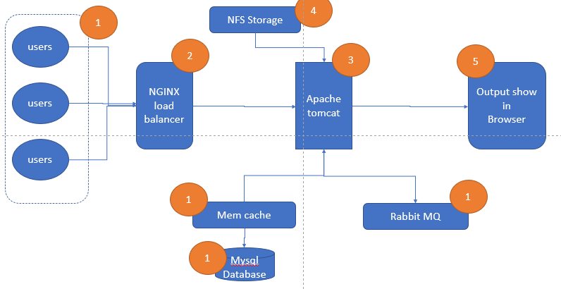
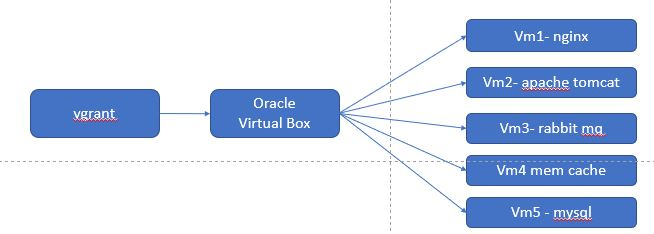

# proj01-multi-tier-web-app
Complete project to create a multi tier web application in  laptop or on-premises 

# tools use 
* vagrant  = for writing the script to provsion all server - nginx, tomcat, rabbit mq, memcached & mysql  
* nginx = Web services, I am using for route the incomming traffic to tomcat application server  
* rabbit mq = Message brocker and queue agent to connect between tomact apps server and memcached server  
* memcached = database cache software, use to increase application speed  
* mysql = store the transation data   
*
# Overview 

# Provisioning of Server / VM

# Complete Steps
  
* Install the following thing in your working laptop and pc   
   1) oracle virtual box
   2) vagrant
   3) git
* execute the following command in your laptop by git bash 
   1) vagrant plugin install vagrant-hostmanger
   2) vagrant plugin install vagrant-vbguest
   3) vagrant up
 * check all the vm's hostname should be entered automatically in /etc/host file in your laptop or working pc 